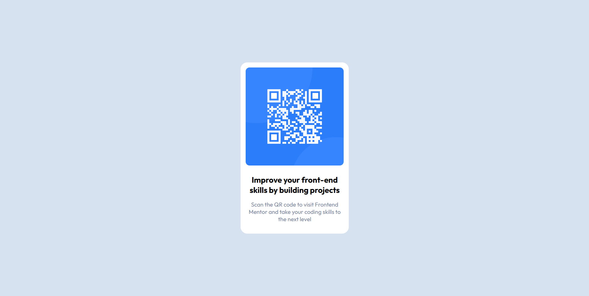

# Frontend Mentor - QR code component solution

This is a solution to the [QR code component challenge on Frontend Mentor](https://www.frontendmentor.io/challenges/qr-code-component-iux_sIO_H). Frontend Mentor challenges help you improve your coding skills by building realistic projects. 

## Table of contents

- [Overview](#overview)
  - [Screenshot](#screenshot)
  - [Links](#links)
- [My process](#my-process)
  - [Built with](#built-with)
  - [What I learned](#what-i-learned)
- [Author](#author)


## Overview

### Screenshot



### Links

- Solution URL: [Github](https://github.com/Dante-afk/qr-code-component-challenge)
- Live Site URL: [Live solution](https://qr-code-component-challenge-olive.vercel.app/)


## My process

### Built with

- Semantic HTML5 markup
- CSS custom properties
- Mobile-first workflow


### What I learned

I learnt that using rem for marginbs and font size is more efficient than compared to px as rem is more responsive which, in turn, creates a better user interface. This challenge gave me a  better understanding in css flex-box and grids.

```css
body {
    margin: 0;
    background: hsl(212, 45%, 89%);
    font-family: "Outfit", sans-serif;
    min-height: 100vh;
    display: grid;
    place-content: center;
}
main {
    max-width: 17rem;
    margin: 1rem auto;
    background: hsl(0, 0%, 100%);
    border-radius: 17px;
    padding: 0.8rem;
}

.heading {
    font-weight: 700;
    font-size: 1.25rem;
    margin-bottom: 0.9rem;
}

.paragraph {
    font-weight: 400;
    font-size: 0.9rem;
    color:  hsl(220, 15%, 55%);
    

}
.qrcode {
    max-width: 100%;
    border-radius: 4%; 
    margin-bottom: -0.5rem;
}
```

## Author

- Website - [Dhruv Mehta](https://dhruvmehta02.netlify.app/)
- Frontend Mentor - [@Dante-afk](https://www.frontendmentor.io/profile/Dante-afk)


